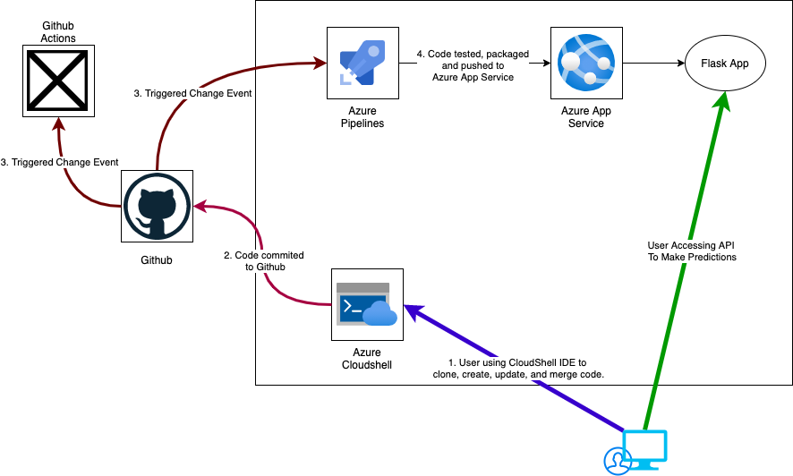
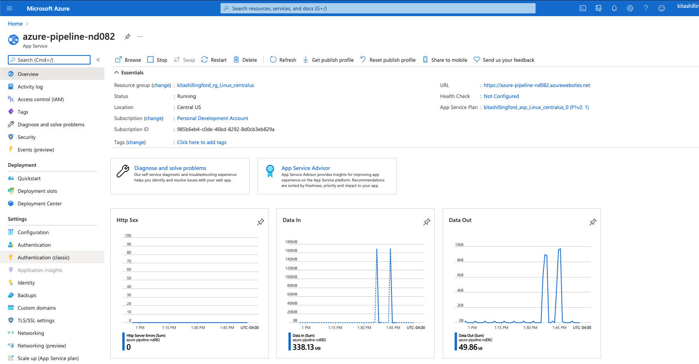
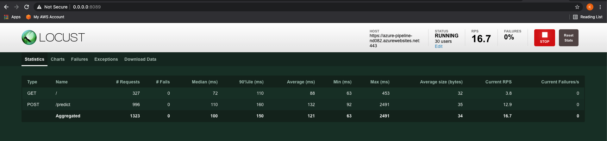
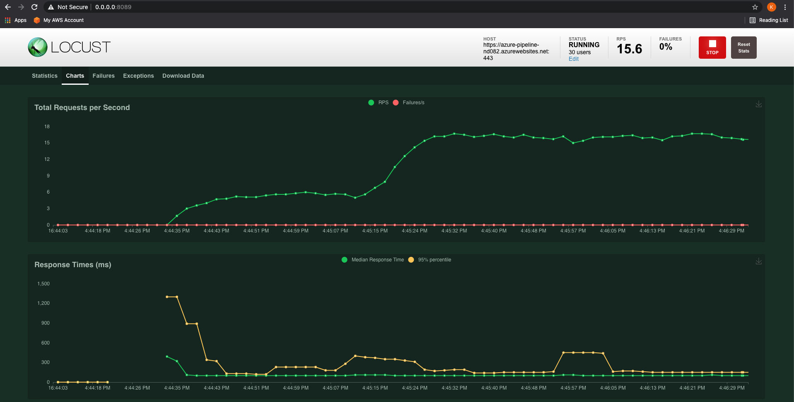

[](https://github.com/kshill/azure-pipeline-nd082/actions/workflows/main.yml)

# Overview

This project will demonstrate the use of an Azure CI/CD pipeline to build, test, and operationalize an ML API that makes housing price predictions in Boston based on a set of criteria. The API is built using Python utilizing the Flask web framework. The project utilizes Azure Web Apps to host the ML price predictions API, Github Actions for continuous integration (CI) and Azure Pipelines for continuous delivery (CD).

## Project Plan

* [Trello Kanban Task Board](https://trello.com/invite/b/hVOAy40q/767e94ece0bc05aed4826aa9724596cf/building-azure-ci-cd-pipeline)

* [Final Project Plan](https://docs.google.com/spreadsheets/d/14MsfybRl9IBQCXpz52GzsAPmwmYQJjL2XewXLKN9vyg/edit?usp=sharing)

## Instructions

### Architectural Diagram



### Azure Subscription

1. An Azure subscription will be needed in order to run this project. Create an Azure subscription if not already created.
    * If you do not have Azure subscription, use the following link to get a free Azure account: [Create Free Azure Account](https://azure.microsoft.com/en-us/free/)


### Setup and Configure Azure Cloudshell

1. Log into the [Azure Portal](https://portal.azure.com). 
1. Click on the Azure Cloud Shell icon.


3. Select Bash on the Welcome to Azure Cloud Shell window.
1. Cloud Shell will be launched within a few minutes
1. At the Cloud Shell prompt, enter in the following command to create SSH keys:

```bash
ssh-keygen -t rsa
```

6. Click [Enter] 3 times until you get back to the Cloud Shell prompt.
1. At the Cloud Shell prompt, enter in the following command to get the content of the SSH key that was just generated:

```bash
cat cat ./.ssh/id_rsa.pub
```

8. Copy the output of the command as it will be used to configure Github integration with the Cloudshell.
1. Log into Github and create a new project.
1. At the top right of the Github project click on the profile icon and select settings.
1. Click on **SSH and GPG key**.
1. Click on **New SSH Key**.
1. Paste the output of id_rsa.pub in the Key input box and give the key a title.
1. Click on **Add SSH Key**.

### Clone Github Project In Azure Cloud Shell

1. While logged into the Github go to the following url and copy the Github clone SSH command: 

    https://github.com/kshill/azure-pipeline-nd082

1. Open the Azure Cloud Shell. At the Cloud shell prompt, enter in the following command to clone the project from github:

```bash
git clone git@github.com:kshill/azure-pipeline-nd082.git
```

3. If the project is successfully cloned then the following command can be ran in order to see the status of the Git project:

```bash
git show
```

4. You should an output similar to the image below:


### Setup and Configure Azure App Service

1. Open the Azure Cloud Shell and navigate to the project directory. At the Cloud Shell prompt, enter in the following command:

```azurecli
az webapp up --sku F1 -n azure-pipeline-nd082
```

2. The command will return a url that can be used to verify that the Azure web app is functional. Open a browser and go to the url. The following page should be seen which shows the project running:


### Running Makefile

1. Open the Azure Cloud Shell and navigate to the project directory. At the Cloud Shell prompt, enter in the following command:

```azurecli
make all
```

The following image displays the passing tests after running the `make all` command from the `Makefile`


### Test Run

1. The following image shows the output of a test run using the Github actions.


### Azure Pipeline

1. Create an Azure Devops project and connect it to Azure using the following instructions:

[Create an Azure DevOps Project and Connect To Azure](https://docs.microsoft.com/en-us/azure/devops/pipelines/ecosystems/python-webapp?view=azure-devops#create-an-azure-devops-project-and-connect-to-azure)

2. Create a Python python pipeline to deploy App Service using the following instructions:
[Create A Python-specific pipeline to deploy to App Service](https://docs.microsoft.com/en-us/azure/devops/pipelines/ecosystems/python-webapp?view=azure-devops#create-a-python-specific-pipeline-to-deploy-to-app-service)

3. Execute the pipeline using the following instructions:
[Run the pipeline](https://docs.microsoft.com/en-us/azure/devops/pipelines/ecosystems/python-webapp?view=azure-devops#run-the-pipeline)

4. Upon successful execution of the pipeline you should see a comparable output of the pipeline as shown in the image below:


5. Upon successful execution of the pipeline you will see that the pipeline automatically updates the Azure Web App with the code from the repository as shown in the image below:


6. From the Azure portal you can also see that the Azure Web App is in a running state:



### Using ML Flask App Predictions

1. Open the Azure Cloud Shell.
1. Edit the **make_predict_azure_app.sh** file with the Cloud Shell visual studio editor.
1. Modify the url on line 28 by replacing the URL with the url provided by Azure WebApps.
1. Save the file and exit the editor.
1. At the Cloud Shell Prompt execute the following command:

```bash
./make_predict_azure_app.sh
```

6. The command will return back a prediction. The following image shows wthe output of the command:


### Azure WebApp Logs

1. To view the streamed Azure Web App Logs execute the following command:

```bash
az webapp log tail --resource-group <Resource Group Name> --name <Azure WebApp Name>
```

2. The following images show the results of both streaming the webapp logs and going to the Azure logs directory for Azure Web Apps:


* Output of streamed log files from deployed application


* Output of streamed log files after pipeline deployment


### Locust Performance Tests

**Locust Script Running**


**Locust Statistics**


**Locust Graph**


## Enhancements

The enhancement I would make is adding both an alive and load testing step to the **Deploy** stage in the pipeline to ensure that the API was functioning properly after it was deployed. The alive test would tell us that the API was ready to accept requests. The load test would help us to determine if performance optimizations were needed and if we needed to scale up the app service.

## Demo 

* [Azure Devops CI/CD Pipeline - YouTube](https://youtu.be/daIh0Qyh5rM)

